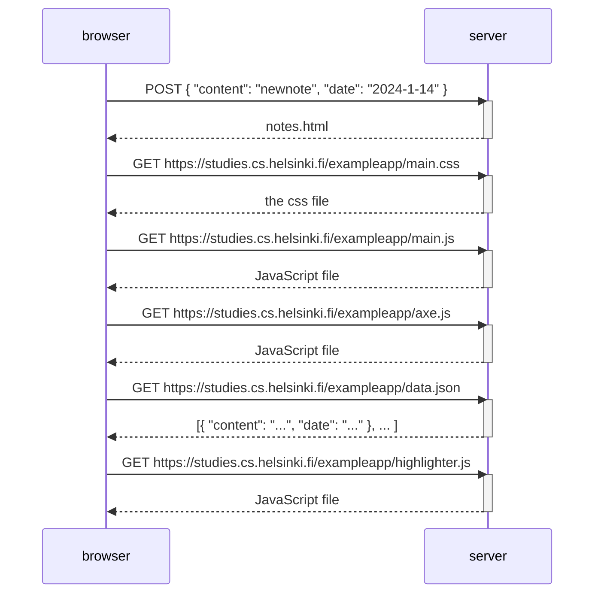

```mermaid 

sequenceDiagram
    participant browser
    participant server
    
    browser->>server: POST { "content": "newnote", "date": "2024-1-14" }
    activate server
    server-->>browser: notes.html
    deactivate server
    
    browser->>server: GET https://studies.cs.helsinki.fi/exampleapp/main.css
    activate server
    server-->>browser: the css file
    deactivate server
    
    browser->>server: GET https://studies.cs.helsinki.fi/exampleapp/main.js
    activate server
    server-->>browser: JavaScript file
    deactivate server
    
    browser->>server: GET https://studies.cs.helsinki.fi/exampleapp/axe.js
    activate server
    server-->>browser: JavaScript file
    deactivate server
    
    browser->>server: GET https://studies.cs.helsinki.fi/exampleapp/data.json
    activate server
    server-->>browser: [{ "content": "...", "date": "..." }, ... ]
    deactivate server    

    browser->>server: GET https://studies.cs.helsinki.fi/exampleapp/highlighter.js
    activate server
    server-->>browser: JavaScript file
    deactivate server
```